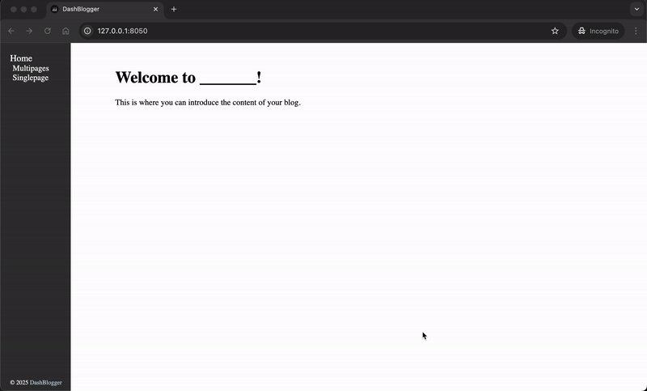
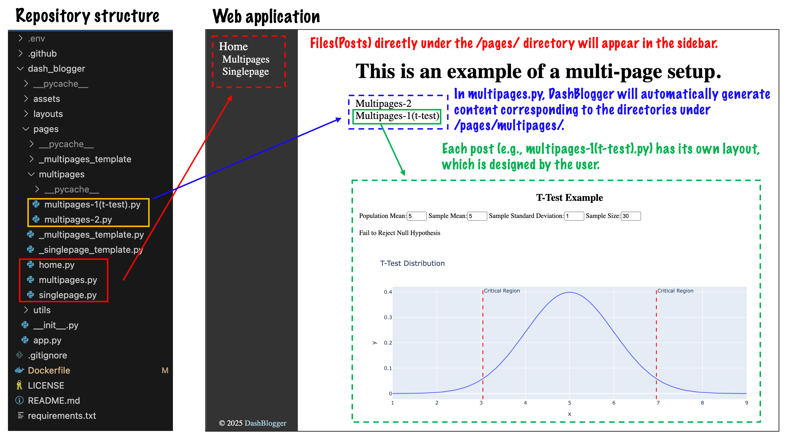

# DashBlogger

DashBlogger is an interactive and scalable blog application built with Dash and 
Plotly. It empowers users to create, visualize, and share blog posts with dynamic 
data visualizations, leveraging the simplicity and power of Python. The app is 
designed for seamless integration, easy customization, and deployment-ready 
features.

---

## Key Features
- [x] **Interactive blog content** powered by Dash for dynamic and engaging posts.  
- [x] **Post management with Python files**: Each blog post is represented by a 
      Python file.  
- [x] **Production-ready deployment**: Automatically builds a Docker image with 
      Gunicorn pre-configured.  

---

## Getting Started

### Single Page Blog
To create a single-page blog:
1. Add your post as a Python file under the `/pages/` directory.  

### Multi-Page Blog
To create a multi-page blog:
1. Add a "topic" post as a Python file under `/pages/`.  
2. Place your sub-posts in a subdirectory named `/pages/<topic>/`.  
   - Ensure the subdirectory name matches the topic name in `/pages/`.

---

## Deployment

### Configure Docker Hub
Set up your Docker Hub information in GitHub for automated Docker image 
creation:  
1. Add `DOCKERHUB_USERNAME` as a variable in GitHub Variables.  
2. Add `DOCKERHUB_TOKEN` as a secret in GitHub Secrets.  

---

---

Feel free to contribute, customize, and share your interactive blogs with the 
world!
